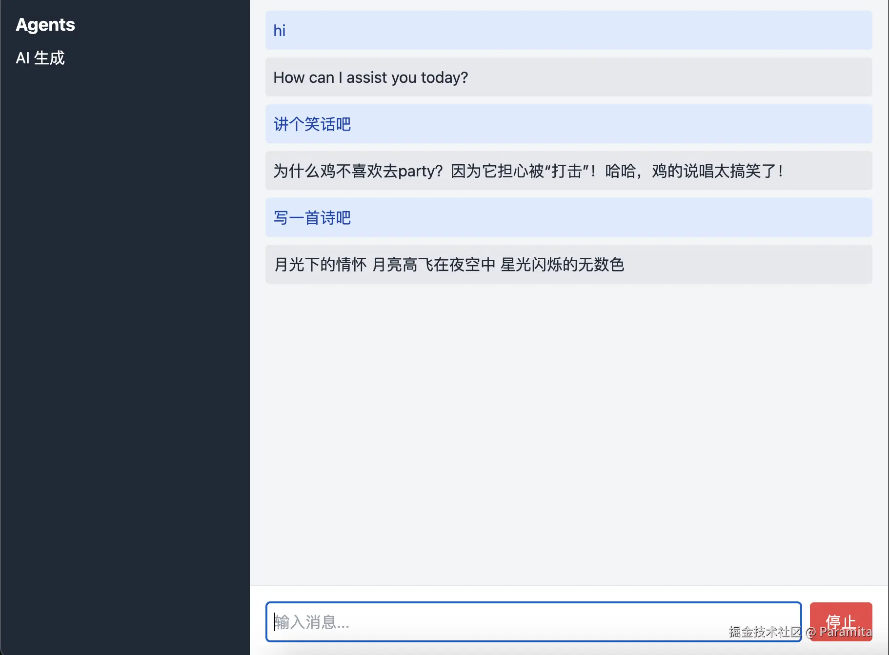

# README

这是一个简单的本地AI问答应应用demo。

效果如下：


## 技术栈

使用的技术栈包括：
- `Ollama`：本地大模型CLI
- `React` + `TailwindCSS`：前端页面
- `Node` + `Koa`：简单的后端服务 
- `socketIO`：用于实时问答

## 本地启动

### 一、分别启动

首先，需要安装ollama，在docker中安装如下：
```bash
# docker 安装 ollama
docker run -d -v ollama:/root/.ollama -p 11434:11434 --name ollama ollama/ollama
```
如果已经安装，下次可以直接启动 ollama 容器：
```bash
docker start ollama
```
然后启动大模型：
```bash
# run llama 3.2 model
docker exec -it ollama ollama run llama3.2
```

然后就可以启动我们的应用了：

1. 启动后端服务器：
```bash
cd server && pnpm start
```
2. 启动前端开发服务器：
```bash
cd client && pnpm start
```
3. 打开浏览器，访问 `http://localhost:3000` 访问 Web 应用。

### 二、使用 docker-compose 启动
1. 在根目录下运行 `docker-compose` 命令直接启动 Ollama服务 和 Web 应用：
```bash
docker-compose -f docker-compose.dev.yml up --build
```

2. 然后在Ollama容器中运行大模型：
```bash
docker exec -it ollama ollama run llama3.2
```

简单测试一下 Ollama 服务是否可用，打开新的终端发送请求：
```bash
curl -X POST http://localhost:11434/api/generate \
-H "Content-Type: application/json" \
-d '{
  "model": "llama3.2",
  "prompt": "hello!",
  "stream": false
}'
```
如果收到response回答，则说明 Ollama 中运行的大模型已经就绪。

3. 访问 `http://localhost:3001` 访问 Web 应用。