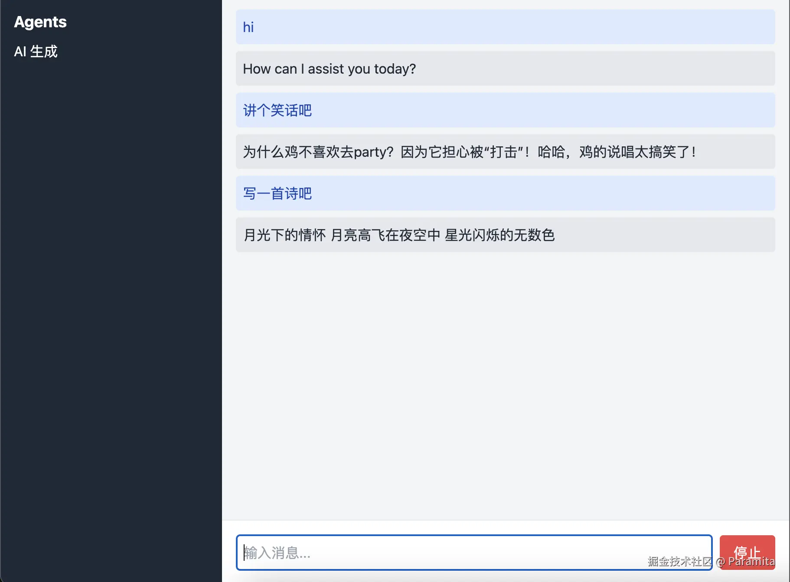

# README

这是一个简单的本地AI问答应应用demo。

效果如下：


## 技术栈

使用的技术栈包括：
- `Ollama`：本地大模型CLI
- `React` + `TailwindCSS`：前端页面
- `Node` + `Koa`：简单的后端服务 
- `socketIO`：用于实时问答

## 本地启动

### 一、分别启动

首先，需要安装ollama，在docker中安装如下：
```
# docker 安装 ollama
docker run -d -v ollama:/root/.ollama -p 11434:11434 --name ollama ollama/ollama
```
如果已经安装，下次可以直接启动 ollama 容器：
```
docker start ollama
```
然后启动大模型：
```
# run llama 3.2 model
docker exec -it ollama ollama run llama3.2
```

然后就可以启动我们的应用了：

1. 启动后端服务器：
```
cd server && pnpm start
```
2. 启动前端开发服务器：
```
cd client && pnpm start
```
3. 打开浏览器，访问 `http://localhost:3000` 访问 Web 应用。

### 二、使用 docker-compose 启动
1. 在根目录下运行 `docker-compose` 命令直接启动 Ollama服务 和 Web 应用：
```
docker-compose -f docker-compose.dev.yml up --build
```

2. 然后在Ollama容器中运行大模型：
```
docker exec -it ollama ollama run llama3.2
```

3. 一切就绪后，访问 `http://localhost:3001` 访问 Web 应用。